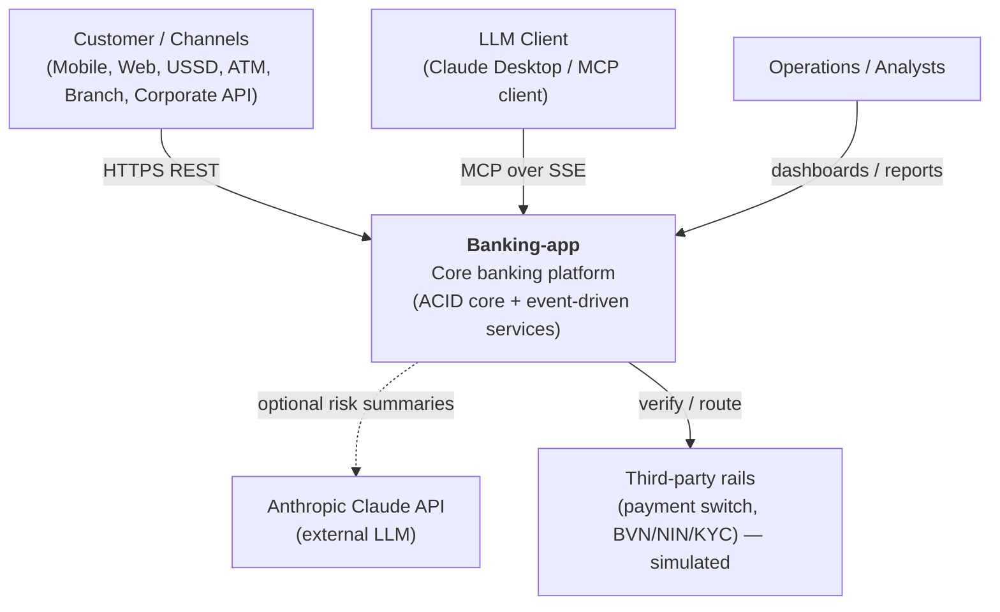
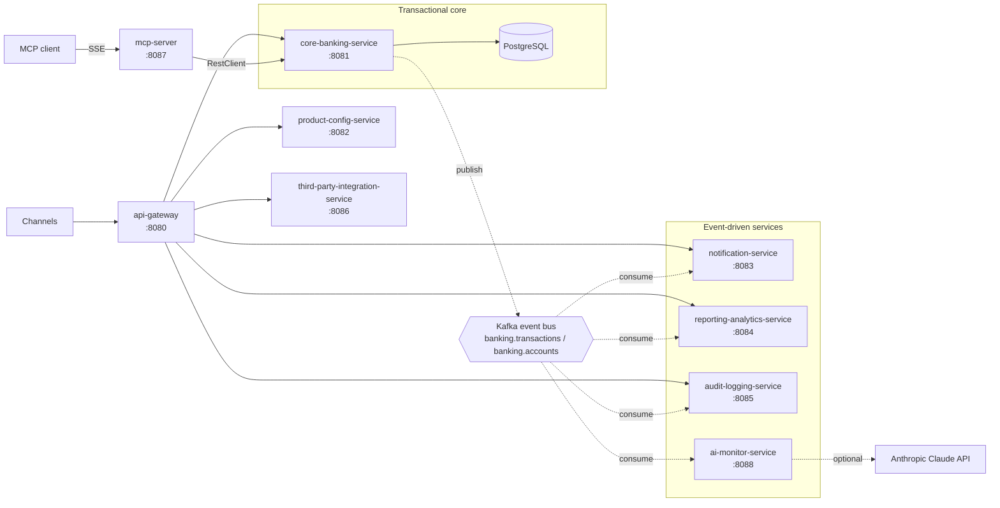

# Architecture Diagrams

Version-controlled architecture diagrams for **Banking-app**, written in
[Mermaid](https://mermaid.js.org/) so they render directly on GitHub and evolve with the code.

| Diagram | File | Shows |
|---|---|---|
| System Context & Container | this file | Actors, external systems, and the services/containers |
| Design / Component | [design-diagram.md](design-diagram.md) | Module dependencies, layering, core internals |
| Deployment | [deployment-diagram.md](deployment-diagram.md) | Runtime topology (Docker/Kubernetes), infra, config |
| Interaction (Sequence) | [interaction-diagram.md](interaction-diagram.md) | Key end-to-end flows step by step |
| Data Flow (DFD) | [dataflow-diagram.md](dataflow-diagram.md) | How data moves between processes and stores |

> Keep these in sync with the code and with [`docs/adr/`](../adr). A structural change should update
> the relevant diagram in the same PR.

---

## 1. System Context

Who and what interacts with the platform.

---

## 2. Container View

The deployable units (one Spring Boot service per container) and the shared infrastructure.
Solid = synchronous request/response; dashed = asynchronous events.

**Legend** — `[ ]` service/container · `[( )]` datastore · `{{ }}` message bus ·
solid arrow = synchronous REST · dashed arrow = asynchronous event / optional call.
