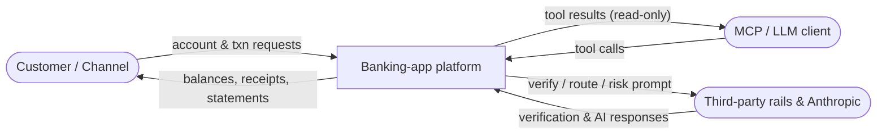
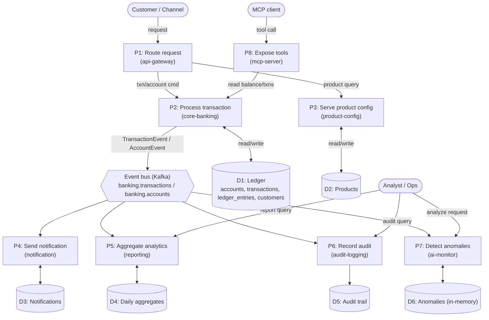

# Data Flow Diagram (DFD)

How data moves between external entities, processes, and data stores. Uses Gane–Sarson-style
elements expressed in Mermaid: external entities, processes (services), and data stores.

## Level 0 — Context



## Level 1 — Processes and data stores



## Data classification & handling

| Data | Store / flow | Sensitivity | Handling |
|---|---|---|---|
| Balances, amounts | D1 ledger, events | Financial | `BigDecimal`; changed only via journal engine under lock |
| Account / customer PII (name, email, phone, BVN) | D1 ledger | PII | Least privilege; mask in logs; never log full BVN |
| Ledger entries (DR/CR) | D1 | Financial (immutable) | Append-only; corrections via reversing transactions |
| Audit trail | D5 | Compliance (immutable) | Append-only; no update/delete endpoints |
| Event payloads | Kafka topics | Financial + PII | Trusted-packages deserialization; do not widen consumers |
| Anomalies | D6 (in-memory) | Derived | Ephemeral; rebuilt from the stream |
| API keys / DB creds | env / secrets manager | Secret | Never in code/logs/images; placeholders only in `application.yml` |

See [`.claude/skills/security/SKILL.md`](../../.claude/skills/security/SKILL.md) for the full data
protection and threat-modeling guidance.
```
