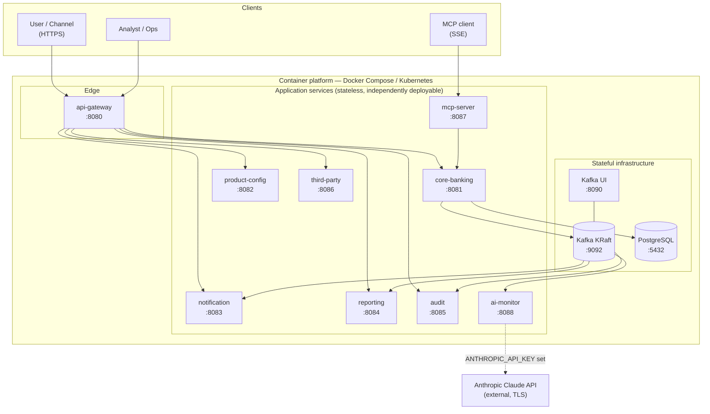
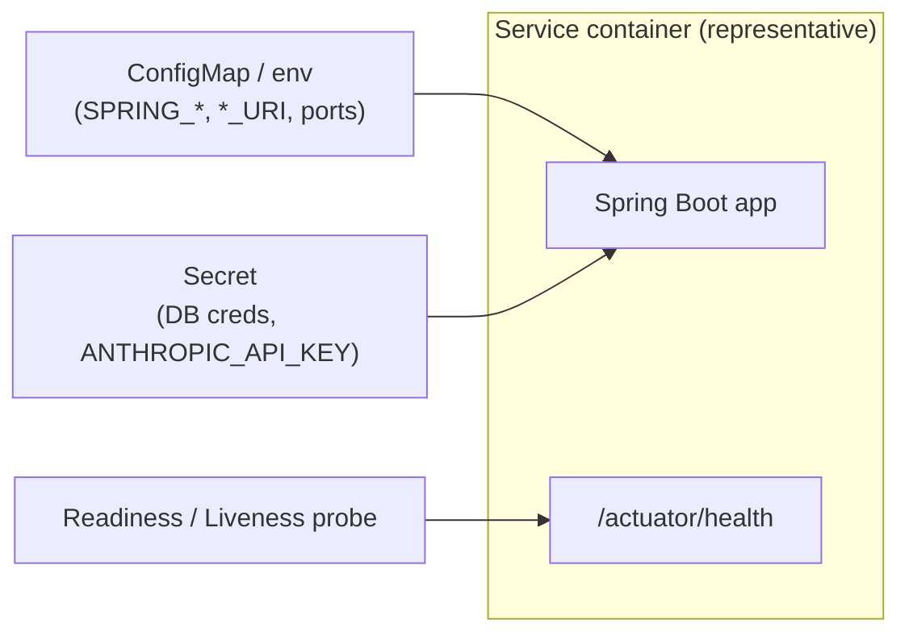

# Deployment Diagram

Runtime topology. Each service ships as its own container image (multi-stage `Dockerfile`, JRE 21
runtime). Locally they are orchestrated with `docker-compose`; in production the same images run on
a container platform (e.g. Kubernetes). Configuration and secrets are injected via environment
variables — never baked into images.

## 1. Container topology



## 2. Health, config & scaling



## 3. Deployment notes

- **Images:** built from the repo root context with each `<service>/Dockerfile`
  (`mvn -pl <service> -am -DskipTests package` → `eclipse-temurin:21-jre`). CI builds one image per
  service via a matrix.
- **Stateless services** (`gw`, `cb`, `pc`, `no`, `re`, `au`, `tp`, `mcp`, `am`) scale horizontally.
  The consumers scale within their Kafka consumer group; the core scales behind the gateway (DB
  locking preserves correctness under concurrency).
- **Stateful infra** (Kafka, PostgreSQL) is external/managed; connection details come from env
  (`SPRING_KAFKA_BOOTSTRAP_SERVERS`, `SPRING_DATASOURCE_*`).
- **Configuration:** non-secret via ConfigMap/env; secrets via a secrets manager / Kubernetes
  Secret. See [`.claude/rules/rules.md`](../../.claude/rules/rules.md) (Security Rules).
- **Probes:** readiness/liveness on `/actuator/health`; readiness should also reflect dependency
  reachability where appropriate.
- **Rollout:** deploy per service with immutable image tags (git SHA) and a rollback to the prior tag;
  verify health and Kafka consumer-group lag after rollout.
```
