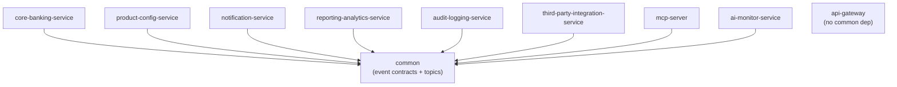
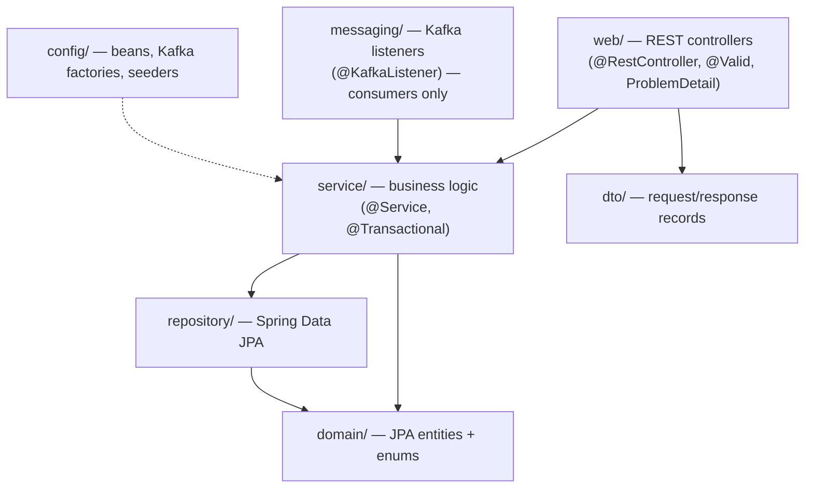
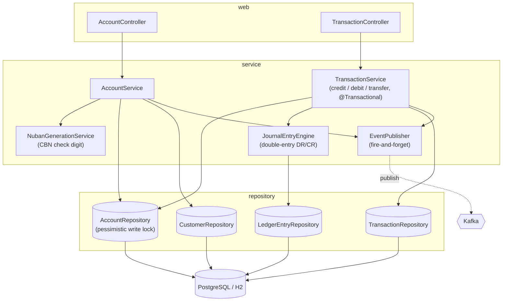

# Design / Component Diagram

Internal design: Maven module dependencies, the layered pattern every service follows, and the
component breakdown of the transactional core.

## 1. Module dependency graph

All business services depend on the shared `common` contracts module (event records + topic names).
`api-gateway` is pure routing and has no `common` dependency.

## 2. Layered architecture (per service)

Each service follows package-by-layer with strict inward dependencies and constructor injection.

## 3. Core-banking-service component breakdown

The heart of the system. Controllers stay thin; the "stored-procedure" processes live in services;
money only changes through the journal engine on pessimistically-locked accounts, and events are
published **after** commit.

**Key invariants** (see [`CLAUDE.md`](../../CLAUDE.md) Forbidden Changes):
money is `BigDecimal`; money paths are `@Transactional`; accounts are locked in deterministic order;
every posting is a balanced DR/CR; publishing never blocks or rolls back a committed transaction.
