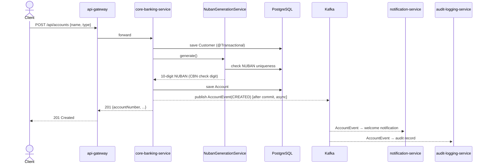
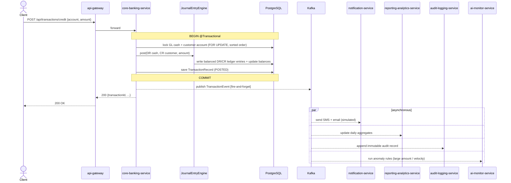
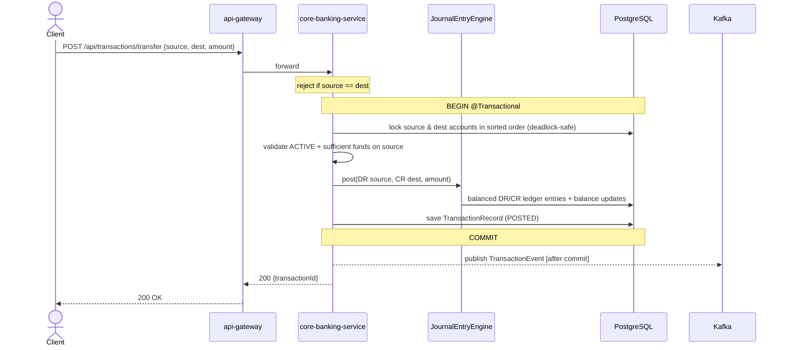
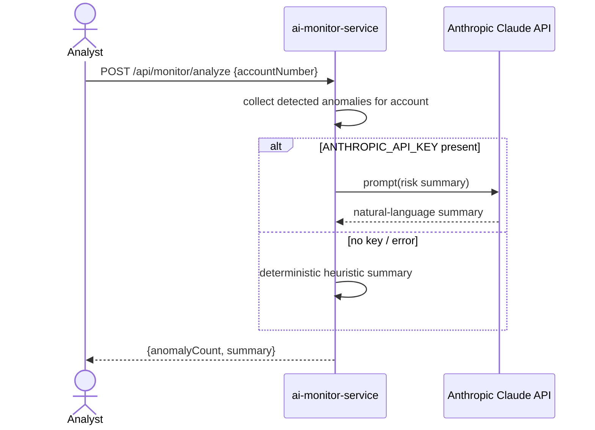

# Interaction (Sequence) Diagrams

Step-by-step behavior of the key flows. Synchronous calls are solid; asynchronous event delivery is
shown crossing the Kafka boundary.

## 1. Open account (NUBAN generation)



## 2. Credit (deposit) with downstream fan-out



## 3. Fund transfer (deadlock-safe locking)



## 4. MCP tool call (AI layer, read-only)

```mermaid
sequenceDiagram
    participant LLM as MCP Client (Claude Desktop)
    participant MCP as mcp-server
    participant CB as core-banking-service

    LLM->>MCP: SSE connect / list tools
    MCP-->>LLM: getAccountBalance, listRecentTransactions, getProductCatalog
    LLM->>MCP: call getAccountBalance(nuban)
    MCP->>CB: GET /api/accounts/{nuban}/balance (RestClient)
    alt core reachable
        CB-->>MCP: balance
    else core unavailable
        MCP-->>MCP: simulated fallback value
    end
    MCP-->>LLM: tool result (read-only; no money movement)
```

## 5. AI risk analysis (optional Claude)


